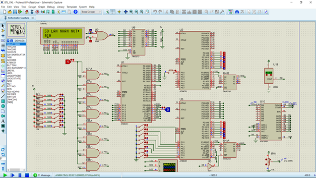

# GIỚI THIỆU SƠ LƯỢC VỀ BÀI TẬP MỞ RỘNG ĐA XỬ LÝ VỚI VI ĐIỀU KHIỂN 8051

- Đề tài “Đa xử lý” với mục đích thí nghiệm và kiểm chứng khả năng truyền thông giao tiếp giữa nhiều vi xử lý 8051 theo cơ chế Master-Slave thông qua UART 9 bit. Master sẽ điều khiển các chức năng chính và chọn Slave để ra lênh hoạt động. Slave hoạt động tùy theo chế độ nhận từ Master và phát dữ liệu ngược về Master nếu được yêu cầu.
- Bài báo cáo gồm 3 phần: sơ đồ thiết kế , lưu đồ giải thuật điều khiển và kết quả mô phỏng lập trình.

    Slave 1 truyền tín hiệu số lần nhấn nút cho Master và Master gửi tín hiệu P1.

    Slave 2 truyền tín hiệu nhiệt độ hiện tại cho Master và Master gửi lại tín hiệu P1.

- Code được thực hiện trên ngôn ngữ assembly thông qua Keil uVision, phần mô phỏng được thực hiện với Proteus.